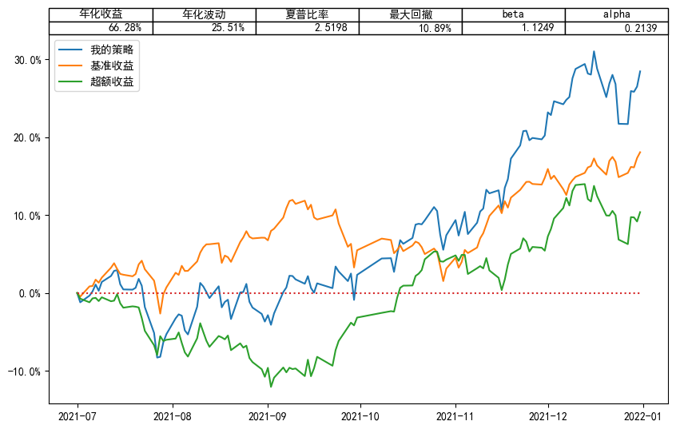

# 反转与动量策略回测系统
这是一个量化交易策略的回测系统, 它能帮助您在 2020-2022 年的任何时间区间内对 $n$ 日反转 / 动量策略进行回测. 以反转策略为例, 其具体定义如下:

给定排序时长 $n$ 及股票池大小 $n_{stock}$. 在每个交易日结束前, 计算所有股票在前 $n$ 个交易日 (含当天) 的累计收益率. 根据该收益率得到当天的目标股票集 $\mathcal{S}$, 并将现有资金重新等额分配在 $\mathcal{S}$ 中各只股票上:
- 对于反转策略, 取收益率最低的 $n_{stock}$ 只股票.
- 对于动量策略, 取收益率最高的 $n_{stock}$ 只股票.

这里为了避免表现出较极端收益率的股票可能出现的异常行为, 我们提供了在上述策略的运行过程中事先去除一部分收益率最低 / 高的股票的选项 (见使用说明中的 `trimsize` 参数). 

以下是该系统提供的具体功能及使用方法. 我们的系统包括以下模块:
- `load.py` 实现数据的读取.
- `signalgen.py` 生成回测信号.
- `backtest.py` 对策略进行回测.
- `display.py` 展示回测结果.

要使用各模块中的接口, 我们需要事先调用该模块
```python
from mysystem.load import *
from mysystem.signalgen import *
from mysystem.backtest import *
from mysystem.display import *
```

## 读取数据
`load.py` 中提供以下接口. 其中的基本面数据虽然不会在后续的策略回测中用到, 但这里仍然支持您查询.
### daily
查询特定时间段内特定股票的日行情. 输入参数包括
- `stk_id`: 股票代码, 非必选. 若输入为空则返回所有股票行情.
- `start_date`: 起始日期, 非必选. 要求输入格式为 `'YYYY-MM-DD'` 的字符串.
- `end-date`: 终止日期, 非必选. 要求输入格式为 `'YYYY-MM-DD'` 的字符串.
- `adj`: 是否复权, 默认`False`.
### balance
查询特定时间段内特定股票的资产负债表. 输入参数包括
- `stk_id`: 股票代码, 非必选. 若输入为空则返回所有股票行情.
- `start_date`: 起始日期, 非必选. 要求输入格式为 `'YYYY-MM-DD'` 的字符串.
- `end-date`: 终止日期, 非必选. 要求输入格式为 `'YYYY-MM-DD'` 的字符串.
### income
查询特定时间段内特定股票的利润表. 输入参数包括
- `stk_id`: 股票代码, 非必选. 若输入为空则返回所有股票行情.
- `start_date`: 起始日期, 非必选. 要求输入格式为 `'YYYY-MM-DD'` 的字符串.
- `end-date`: 终止日期, 非必选. 要求输入格式为 `'YYYY-MM-DD'` 的字符串.
### cashflow
查询特定时间段内特定股票的现金流量表. 输入参数包括
- `stk_id`: 股票代码, 非必选. 若输入为空则返回所有股票行情.
- `start_date`: 起始日期, 非必选. 要求输入格式为 `'YYYY-MM-DD'` 的字符串.
- `end-date`: 终止日期, 非必选. 要求输入格式为 `'YYYY-MM-DD'` 的字符串.
### annotation
查询特定时间段内特定股票的财务报表附注. 输入参数包括
- `stk_id`: 股票代码, 非必选. 若输入为空则返回所有股票行情.
- `start_date`: 起始日期, 非必选. 要求输入格式为 `'YYYY-MM-DD'` 的字符串.
- `end-date`: 终止日期, 非必选. 要求输入格式为 `'YYYY-MM-DD'` 的字符串.
### close_daily
查询特定时间段内所有股票的复权收盘价. 输入参数包括
- `start_date`: 起始日期, 非必选. 要求输入格式为 `'YYYY-MM-DD'` 的字符串.
- `end-date`: 终止日期, 非必选. 要求输入格式为 `'YYYY-MM-DD'` 的字符串.
### index_daily
查询特定时间段内的指数行情. 输入参数包括
- `start_date`: 起始日期, 非必选. 要求输入格式为 `'YYYY-MM-DD'` 的字符串.
- `end-date`: 终止日期, 非必选. 要求输入格式为 `'YYYY-MM-DD'` 的字符串.

这里的指数是等权指数, 由所有股票的平均收益率计算得到.

## 生成信号
`signalgen.py` 中提供以下接口. 一般情况下, 您在回测时不需要直接调用这些接口.
### signal
计算特定时间段内所有股票的前 $n$ 日收益率. 输入参数包括
- `start_date`: 起始日期, 非必选. 要求输入格式为 `'YYYY-MM-DD'` 的字符串.
- `end-date`: 终止日期, 非必选. 要求输入格式为 `'YYYY-MM-DD'` 的字符串.
- `period`: 排序期时长, 即 $n$ 值. 非必选, 默认值为 `1`.
### select_stocks
在特定时间段内返回前 $n$ 日收益率最低 (高) 的 $n_{stock}$ 只股票. 输入参数包括
- `nstock`: 选取股票的数量, 必选.
- `trimsize`: 事先排除的极端股数量, 默认值为 `0`.
- `start_date`: 起始日期, 非必选. 要求输入格式为 `'YYYY-MM-DD'` 的字符串.
- `end-date`: 终止日期, 非必选. 要求输入格式为 `'YYYY-MM-DD'` 的字符串.
- `period`: 排序期时长, 即 $n$ 值. 非必选, 默认值为 `1`.
- `rever`: 是否反转, 非必选, 默认值为 `True`. 如设定为 `False` 则将使用动量策略, 即返回收益率最高的那些股票.

## 回测策略
`backtest.py` 中提供 **compute_value** 接口, 您可使用该接口得到策略在整个回测期每日的净值, 即按照策略交易后每天的总资产与期初资产的比值. 输入参数包括
- `nstock`: 每天持有的股票的数量, 必选.
- `trimsize`: 事先排除的极端股数量, 默认值为 `0`.
- `start_date`: 起始日期, 非必选. 要求输入格式为 `'YYYY-MM-DD'` 的字符串.
- `end-date`: 终止日期, 非必选. 要求输入格式为 `'YYYY-MM-DD'` 的字符串.
- `period`: 排序期时长, 即 $n$ 值. 非必选, 默认值为 `1`.
- `rever`: 是否反转, 非必选, 默认值为 `True`. 如设定为 `False` 则将使用动量策略.

## 展示结果
`display.py` 中提供以下接口. 您可以用它们来分析 `backtest.py` 中得到的净值数据.
### summary
计算策略的年化收益, 年化波动, 夏普比率, 最大回撤, beta, alpha, 超额收益. 输入参数包括
- `value`: 净值曲线, 必选. 由 `compute_value` 求得, 可见后面的示例.
- `rf`: 无风险收益, 用于夏普比率的计算. 非必选, 默认值为 `0.02`. 

注意, 该接口给出的结果均为原始数据, 未转化为百分数.
### show_result
展示策略的回测结果, 包括 `summary` 中的各个指标与净值曲线 (准确说是收益曲线). 输入参数包括
- `value`: 净值曲线, 必选. 由 `compute_value` 求得, 可见后面的示例.
- `rf`: 无风险收益, 用于夏普比率的计算. 非必选, 默认值为 `0.02`. 

## 使用示例
您可以在 `test.ipynb` 中使用本系统. 下面的例子展示了如何使用本系统回测一个 40 日反转策略在 2021 年全年内的表现. 在每个交易日结束前, 该策略在排除前 40 个交易日收益率最低的 10 只股票后等额买入剩下股票中前 40 个交易日收益率最低的 50 只股票.

导入模块
```python
from mysystem.backtest import *
from mysystem.display import *
```
计算策略的净值
```python
compute_values(50, trimsize=10, start_date='2021-01-01', end_date='2021-12-31', period=40)
```
*输出结果*
```
2021-01-04    1.000000
2021-01-05    0.990720
2021-01-06    0.952304
2021-01-07    0.901428
2021-01-08    0.907121
                ...   
2021-12-27    1.479089
2021-12-28    1.530518
2021-12-29    1.529405
2021-12-30    1.537534
2021-12-31    1.561258
Length: 243, dtype: float64
```
计算策略的各个回测指标
```python
value = compute_values(50, trimsize=10, start_date='2021-01-01', end_date='2021-12-31', period=40)
summary(value)
```
*输出结果*
```
{'annualized rate of return': 0.5902655014257547,
 'annualized volatility': 0.285447641936256,
 'sharpe ratio': 1.9977937024020052,
 'maximum drawdown': 0.17058308091128227,
 'beta': 1.3096286557733932,
 'alpha': 0.2561076867534272,
 'excess return': 2021-01-04    0.000000
 2021-01-05   -0.008671
 2021-01-06   -0.034730
 2021-01-07   -0.060707
 2021-01-08   -0.054006
                 ...   
 2021-12-27    0.258789
 2021-12-28    0.302086
 2021-12-29    0.301606
 2021-12-30    0.297049
 2021-12-31    0.312872
 Length: 243, dtype: float64}
```
展示回测结果
```python
value = compute_values(50, trimsize=10, start_date='2021-01-01', end_date='2021-12-31', period=40)
show_result(value)
```
*输出结果*

